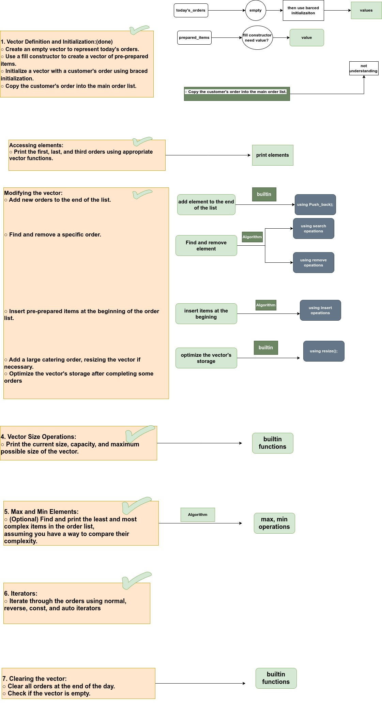

# Managing a Bakery's Daily Orders

## Overview

This project is a Modern C++ application designed to help a bakery manage its daily orders efficiently using vectors. It demonstrates key STL vector operations, including insertion, deletion, iteration, and optimization techniques.

## Features

### Vector Definition and Initialization
- Create an empty vector to represent today's orders.
- Use a fill constructor for pre-prepared items.
- Initialize vectors with customer orders using braced initialization.
- Insert customer orders into the main order list.

### Accessing Elements
- Retrieve the first, last, and third order using vector functions.

### Modifying the Vector
- Add new orders dynamically.
- Find and remove specific orders.
- Insert pre-prepared items at the beginning.
- Resize the vector when handling large catering orders.
- Optimize vector storage after fulfilling some orders.

### Vector Size Operations
- Display the current size, capacity, and maximum possible size.

### Finding Min and Max Orders
- Determine the least and most complex orders.

### Iterators
- Iterate through orders using normal, reverse, const, and auto iterators.

### Clearing the Vector
- Remove all orders at the end of the day and check if the vector is empty.

## Project Structure



## Compilation & Execution

This project follows CMake for easy compilation. To build and run the program:

```sh
mkdir build && cd build
cmake ..
make
./bakery_orders
```

## Implementation Highlights

This project emphasizes:

- Object-Oriented Programming (OOP) principles.
- STL Containers (std::vector, std::algorithm).
- Memory Optimization & Performance Considerations.
- Proper Iteration Techniques & Error Handling.
