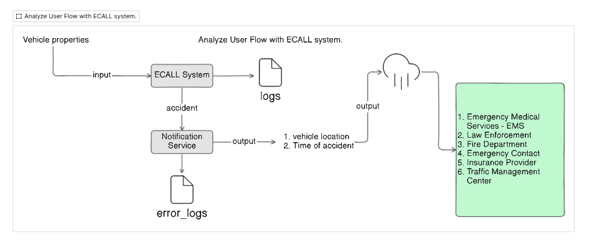
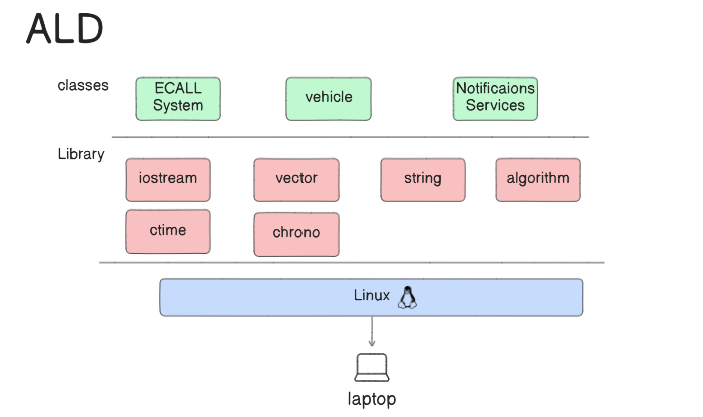
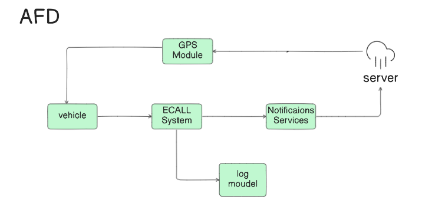
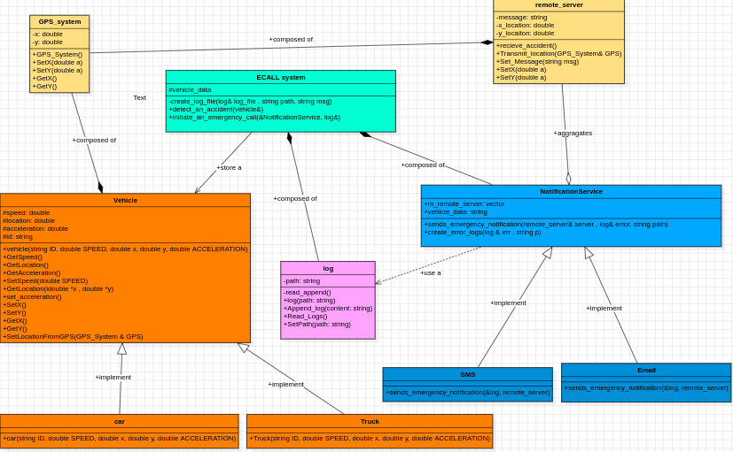
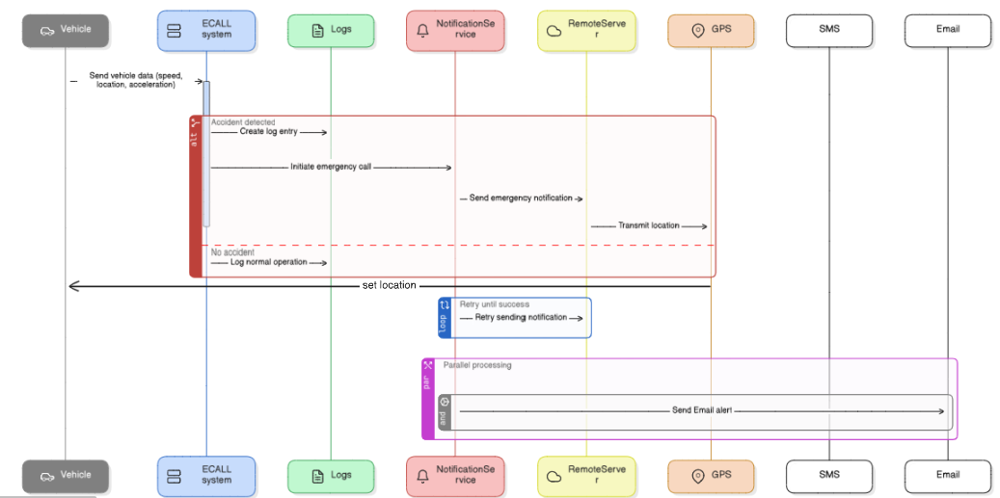

# ECALL Emergency Response System

## Project Overview
The **ECALL Emergency Response System** is a simulated project that detects vehicle accidents and sends emergency notifications. The system applies **Object-Oriented Programming (OOP)** principles, **Modern C++ features**, and incorporates **basic networking and file handling techniques**.

## Features & Functionalities
### 1️⃣ **Vehicle Monitoring & Accident Detection**
- **Vehicle Class**: Stores properties like **speed, location, and acceleration**.
- **Accident Detection Algorithm**: Detects accidents based on sudden deceleration (e.g., a rapid drop in speed to zero).
- **ECALL System**: Initiates emergency procedures when an accident is detected.

### 2️⃣ **Emergency Notification System**
- **NotificationService Class**: Sends accident notifications via **SMS and Email**.
- **Remote Server Communication**: Simulates sending real-time data (vehicle location, time of accident, etc.) to emergency responders.
- **Retry Mechanism**: Ensures notifications are delivered successfully.

### 3️⃣ **OOP Concepts Implementation**
- **Encapsulation**: Private variables for vehicle properties with public getters and setters.
- **Inheritance**: Different vehicle types (e.g., Car, Truck) with unique accident detection behaviors.
- **Polymorphism**: Handling various notification types (SMS, Email) dynamically.

### 4️⃣ **Modern C++ Features Used**
- **Smart Pointers** (`std::unique_ptr`, `std::shared_ptr`) for memory management.
- **Lambda Functions** for event handling (e.g., logging messages, triggering alerts).
- **STL Containers** (`std::vector`, `std::map`) to manage multiple vehicles and their ECALL systems.

### 5️⃣ **Data Management & Logging**
- **Accident Log File**: Stores vehicle ID, accident time, speed, and location in **JSON/CSV** format.
- **Reload Functionality**: Allows loading past accidents for analysis.

### 6️⃣ **Terminal-Based Simulation**
- **Mock Data Entry**: Users input speed, location, and acceleration through the terminal.
- **Automated Accident Simulation**: Users provide sequences of speed/acceleration values to test the system.
- **Real-time Feedback**: Displays vehicle status and triggers ECALL on accident detection.

### 7️⃣ **Optional Enhancements**
- **Networking using Sockets**: Simulates ECALL notifications being sent to a remote server.
- **Observer Design Pattern**: Notifies system components when an accident occurs.
- **Mock GPS System**: Generates realistic vehicle location data.

---
## 🖼️ System Diagrams
To enhance understanding, five key diagrams will be included in the project:

### **1. User Flow Diagram**
📌 **Description:** Represents the **interaction flow** between the user, vehicle, ECALL system, and emergency responders.


### **2. Activity Logic Diagram (ALD)**
📌 **Description:** Explains the **decision-making process** within the **accident detection module**.


### **3. Activity Flow Diagram (AFD)**
📌 **Description:** Shows the **sequence of operations** from data entry to accident detection and notification.


### **4. UML Diagram**
📌 **Description:** Represents the **class structure**, their relationships, and how objects interact.


### **5. Runtime View (Sequence Diagram)**
📌 **Description:** Illustrates the **real-time execution flow** of the system when an accident occurs.


🚀 **These diagrams will be included in the repository as JPEG images for clarity and better visualization.**

---
## 🚀 Getting Started
### **1️⃣ Clone the Repository**
```bash
 git clone https://github.com/Abdelfattah225/Modern_Cpp_Projects/tree/main/04-ECALL%20Emergency%20Response%20System

 cd 04-ECALL Emergency Response System
```

### **2️⃣ Compile the Project**
```bash
g++ -std=c++17 -o PEINT main.cpp
```

### **3️⃣ Run the Simulation**
```bash
 ./PEINT
```

### **4️⃣ Sample Terminal Input**
```plaintext
Enter vehicle speed: 100 km/h
Enter vehicle location (latitude, longitude): 30.0444, 31.2357
Enter acceleration: -9.8 m/s²

⚠️ Accident detected! Initiating emergency call...
```

---
## 🛠️ Technologies Used / will use
- **C++17** for implementation.
- **Smart Pointers** for memory management.
- **Lambda Expressions** for event handling.
- **JSON/CSV** for structured accident logging.
- **Networking (Sockets)** for server communication (optional).
- **Design Patterns (Observer, Singleton, etc.)**.

---
## 📝 Future Improvements
- **GUI Implementation**: A graphical interface for accident detection visualization.
- **Cloud Integration**: Store accident logs in a cloud database.
- **Machine Learning**: Enhance accident detection using AI models.

---
## 🤝 Contributors
👤 **AbdelFattah Moawed** 
 
📧 Email: abdelfattahelazazy@gmail.com

🔗 [LinkedIn](https://www.linkedin.com/in/abdelfattah-moawed/)  

---
## 🏆 Acknowledgments
This project is developed as part of the **ECALL Emergency Response System Simulation**, focusing on **Modern C++**, **OOP principles**, and **real-world accident detection scenarios**.

📢 **If you find this project helpful, please ⭐ the repository!** 🎯
